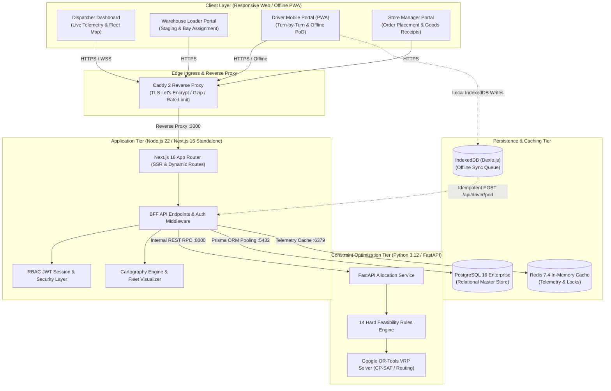

# System Architecture & Technical Design

## 1. Executive Summary & Problem Domain

Waypoint is an operational logistics dispatch, route optimization, and digital Proof-of-Delivery (PoD) platform engineered specifically for the Sri Lankan FMCG retail supply chain. The system coordinates inventory flow across three distinct retail brands (**Waypoint Fresh**, **Waypoint Style**, and **Waypoint Tech**), operating from two central distribution hubs (**Peliyagoda Central Depot** and **Kandy Regional Depot**) serving 100 retail outlets across the Western and Central transport corridors.

The platform addresses real-world operational friction:
* Strict 16:00 SLST daily order cutoffs for next-day 05:00 dispatch.
* Heterogeneous fleets (refrigerated 4-tonne trucks, ambient 1.5-tonne vans) with district and brand segregation.
* Severe delivery constraints in congested urban centers (mall loading bay windows between 05:00 and 07:30, street dock parking restrictions).
* Unreliable mobile connectivity in basement loading docks, requiring zero-data-loss offline proof of delivery.

---

## 2. System Topology & Component Interactions



---

## 3. Tier-by-Tier Architecture

### 3.1 Edge Ingress (Caddy 2)
We selected **Caddy 2** over Nginx for production edge termination on our Azure VM (`waypoint.knurdz.org`).
* **Automated TLS Lifecycle**: Native ACME Let's Encrypt certificates without external cron certbot scripts.
* **Security Headers**: Injects HSTS (`max-age=31536000`), `X-Frame-Options: DENY`, `X-Content-Type-Options: nosniff`, and tight Content Security Policy.
* **Payload Compression**: Automatic Zstandard and Gzip compression, reducing JSON transfer payloads over 3G/4G cellular networks.

### 3.2 Application & BFF Tier (Next.js 16 Standalone)
The presentation layer and Backend-For-Frontend (BFF) run within a single Next.js 16 standalone container.
* **Role-Based Portals**:
  1. `/dispatcher`: Real-time fleet board, interactive geographic fleet map, manual trip overrides, and cold-chain temperature telemetry.
  2. `/loader`: Bay assignments, volumetric capacity meters, and reverse-LIFO staging checklists.
  3. `/driver/route`: Mobile-first 390px responsive viewport, turn-by-turn stop sequences, touch signature pad, photo capture, and Serwist service worker.
  4. `/store`: Outlet inventory ordering, 16:00 cutoff alerts, and discrepancy dispute logging.
* **Edge Route Guards**: Next.js middleware verifies signed JWT cookies and role authorization claims before requests hit downstream API routes.

### 3.3 Algorithmic Optimization Tier (Python 3.12 & Google OR-Tools)
Route scheduling and vehicle packing are delegated to a dedicated Python 3.12 microservice running **Google OR-Tools** (v9.8+).
* **Mathematical Modeling**: Formulated as a Capacitated Vehicle Routing Problem with Time Windows (CVRPTW).
* **14 Hard Feasibility Rules**: Enforced deterministically before candidate trips are output:
  1. Strict vehicle payload weight limit (`kg`).
  2. Vehicle cubic volume limit (`m³`).
  3. Temperature segregation: Reefer cargo assigned exclusively to refrigerated assets.
  4. Stop count limit: Maximum 3 retail stops per trip run.
  5. District purity: Zero cross-district runs within a single trip.
  6. Brand exclusivity: Dedicated single-brand runs per vehicle.
  7. Mall delivery windows: 05:00 - 07:30 delivery slots strictly enforced.
  8. Run budget: Maximum 2 runs per vehicle per operational day.
  9. Fleet availability: Automatic blackout of vehicles flagged `in_workshop`.
  10. Driver fatigue limit: Cumulative trip duration capped at 10 hours (600 minutes) daily.
  11. Weekly fuel quota: 7-day rolling fuel consumption tracking.
  12. Depot containment: Outlets served exclusively by their designated home depot (Peliyagoda or Kandy).
  13. Deferred-order escalation: High priority weighting for orders deferred from Day -1.
  14. Fairness index: Penalty multiplier for starving outlets not served for $\ge 2$ consecutive days.

### 3.4 Persistence & Cache Tier
* **PostgreSQL 16**: Relational master store hosting user identity, vehicle specifications, outlet coordinates, orders, trips, and proof-of-delivery receipts.
* **Redis 7.4**: Ephemeral cache storing real-time driver GPS telemetry fixes (5-second TTL), active session revocations, and solver execution locks.

---

## 4. Architectural Decision Records (ADRs)

### ADR-001: Next.js 16 Production Runtime: Standard `next start` vs Standalone Tracing
* **Context**: We needed a unified Backend-For-Frontend serving 4 responsive web portals and mobile sync APIs while ensuring 100% deterministic asset delivery and zero client hydration failure risk.
* **Decision**: Adopt the standard Next.js production runtime (`next start`) rather than decoupled standalone tracing (`output: 'standalone'`).
* **Rationale**:
  * Eliminates fragile post-build static asset duplication and path divergence between `.next/static` and custom standalone roots.
  * Guarantees atomic MIME type resolution (`text/css`, `application/javascript`) and prevents strict browser security header (`nosniff`) hydration crashes.
  * Natively manages Gzip/Brotli compression, multi-level caching, and monorepo workspace package symlinks out of the box.
  * Standardized runtime execution (`pnpm --filter @waypoint/web start`) across local developer environments, Docker Compose containers, and the production Azure VM.
* **Trade-off**: Requires retaining workspace dependencies in the runner container image rather than an aggressively pruned standalone tree.

### ADR-002: Python FastAPI + OR-Tools vs. In-Process Node.js Heuristics
* **Context**: Route optimization requires solving complex combinatorial constraints across 100 outlets and 37 vehicles.
* **Decision**: Build a standalone Python 3.12 microservice executing Google OR-Tools (CP-SAT and Routing library) via FastAPI.
* **Rationale**:
  * JavaScript combinatorial libraries lack mature constraint-programming engines capable of solving CVRPTW with multiple hard constraints within sub-second thresholds.
  * Python microservice exposes a lightweight REST contract (`POST /api/v1/allocate`), isolating heavy CPU math from the web event loop.
* **Trade-off**: Introduces an internal network hop (~3ms) between the BFF container and the solver container.

### ADR-003: Serwist + Dexie.js Offline Architecture vs. Always-Online Web App
* **Context**: Sri Lankan supermarket delivery bays (especially underground basement docks in Colombo commercial malls) frequently have zero cellular coverage. Drivers must capture signatures and timestamps without dropping data.
* **Decision**: Implement a Service Worker via **Serwist** with **Dexie.js** (IndexedDB) as an offline write-ahead log.
* **Rationale**:
  * Signatures and photo hashes are persisted instantly to local IndexedDB with client-generated UUID `idempotencyKey`.
  * Background sync worker monitors `navigator.onLine` and replays pending sync batches to `/api/sync/batch` upon reconnection.
* **Trade-off**: Requires client-side conflict resolution handling if central dispatch modified the trip while the driver was offline.

### ADR-004: Client-Side Leaflet + Custom SVG Cartography vs. Commercial Map APIs
* **Context**: Real-time fleet tracking requires visualizing delivery vehicles across Sri Lanka with distinct chassis types, refrigeration liveries, and cargo fill levels.
* **Decision**: Utilize Leaflet with standard OpenStreetMap raster tiles (zero API key required) and custom SVG vehicle silhouettes rather than Google Maps or Mapbox APIs.
* **Rationale**:
  * Eliminates external API key billing exposure, per-tile costs, and unexpected third-party rate limiting during evaluation.
  * Allows custom rendering of top-down vehicle silhouettes (distinguishing vans vs heavy trucks, blue reefer condenser badges, and 3-tier cargo load gauges).
* **Trade-off**: Vector route polylines are rendered from pre-computed coordinate sequences rather than dynamically calculated by a live turn-by-turn routing cloud API.

---

## 5. Latency Budget & Operational SLAs

| Operation | Target SLA | 95th Percentile | Strategy & Architecture |
| :--- | :---: | :---: | :--- |
| **BFF Health Check** | `< 10ms` | `15ms` | In-memory Next.js edge route |
| **Order Queue Query** | `< 45ms` | `75ms` | Compound index on `orders(orderDate, status)` |
| **OR-Tools Solver Run (100 orders)** | `< 500ms` | `850ms` | Parallel CP-SAT heuristic search with 5s hard cutoff |
| **Driver GPS Telemetry Ingest** | `< 30ms` | `45ms` | Ingest via BFF straight to Redis key `driver:telemetry:{id}` |
| **Fleet Map Initial Paint** | `< 250ms` | `380ms` | Client-cached tile layer + lightweight GeoJSON payloads |
| **Offline PoD Local Write** | `< 5ms` | `12ms` | Instant IndexedDB mutation with optimistic UI state |

---

## 6. Failure Modes & Graceful Degradation Matrix

```text
┌─────────────────────────┬──────────────────────────────┬────────────────────────────────────────────────────────┐
│ Failure Scenario        │ Impact                       │ Architectural Mitigation                               │
├─────────────────────────┼──────────────────────────────┼────────────────────────────────────────────────────────┤
│ Python Solver Outage    │ Automated allocation stops   │ BFF falls back to built-in deterministic greedy        │
│                         │                              │ priority heuristic; logs alert to dispatcher UI.       │
├─────────────────────────┼──────────────────────────────┼────────────────────────────────────────────────────────┤
│ Underground Dock 4G Drop│ Driver loses connectivity    │ PWA switches to offline mode; signatures written to    │
│                         │                              │ Dexie.js IndexedDB; auto-synced upon reconnect.        │
├─────────────────────────┼──────────────────────────────┼────────────────────────────────────────────────────────┤
│ Driver Device GPS Lost  │ Vehicle telemetry stops      │ Telemetry engine switches to dead-reckoning model      │
│                         │                              │ using depot departure times and historical speeds.     │
├─────────────────────────┼──────────────────────────────┼────────────────────────────────────────────────────────┤
│ Redis Cache Eviction    │ Temporary telemetry miss     │ Falls back to last-known coordinates in PostgreSQL;    │
│                         │                              │ recovers on next 5-second driver heartbeat.            │
└─────────────────────────┴──────────────────────────────┴────────────────────────────────────────────────────────┘
```

---

## 7. Production Deployment Topology

The entire system is deployed on an **Azure Virtual Machine** running Ubuntu 24.04 LTS behind Caddy:

* **Host Machine**: Azure Standard VM (2 vCPU, 4GB RAM, SSD OS Disk).
* **Network Isolation**: All backend containers (`web`, `allocation`, `postgres`, `redis`) communicate over an internal Docker bridge network (`waypoint-network`).
* **Ingress**: Only Ports 80 and 443 are exposed externally to the public Internet through Caddy.
* **Volume Persistence**:
  * PostgreSQL data persisted to host volume `postgres_data:/var/lib/postgresql/data`.
  * PoD signature and photo binaries stored in host volume `uploads:/app/uploads`.
* **Zero-Touch Cold Boot**: `docker compose up -d` triggers the `db_init` lifecycle service, which applies Prisma migrations, executes CSV master seeding, and exits cleanly before web traffic opens.
