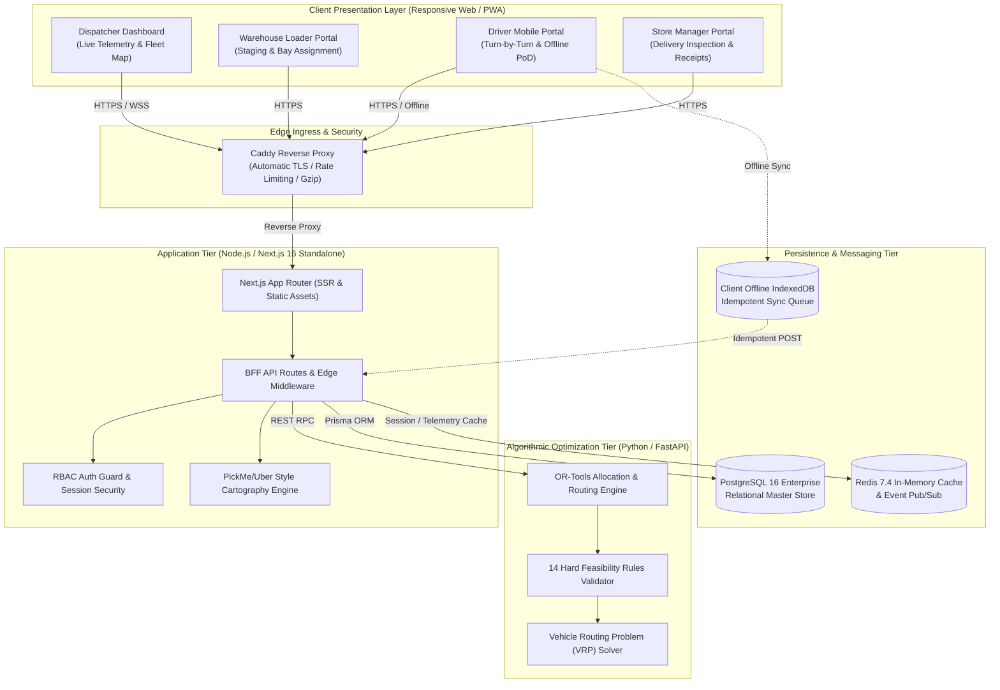
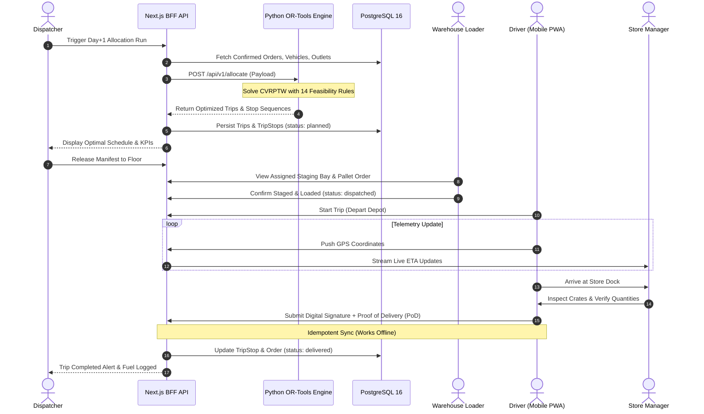

# System Architecture & Technical Design

## 1. System Overview

Waypoint is an enterprise-grade logistics dispatch, route planning, and Proof-of-Delivery (PoD) orchestration platform designed specifically for fast-moving retail distribution networks in Sri Lanka. The architecture handles complex operational constraints across multi-brand retail outlets (Fresh, Style, Tech), heterogeneous vehicle fleets (reefer trucks, ambient vans), strict mall delivery windows, driver work-hour limits, and intermittent network connectivity.

---

## 2. Multi-Tier Architecture & Topology

### 2.1 Ingress Layer (Caddy 2 Reverse Proxy)
- **Automatic TLS**: Automated certificate acquisition and renewal via Let's Encrypt for `waypoint.knurdz.org`.
- **Security Headers**: HSTS, Content-Security-Policy (CSP), `X-Frame-Options: DENY`, `X-Content-Type-Options: nosniff`.
- **Gzip / Zstandard Compression**: Optimized asset delivery across high-latency mobile networks.

### 2.2 Frontend & BFF Layer (Next.js 16 Standalone)
- **Framework**: Next.js 16 with React 19 and Tailwind CSS.
- **Portals**:
  1. **Dispatcher**: Interactive fleet telemetry with live vehicle tracking (PickMe / Uber visual style), route re-assignment, solver triggering, and cold-chain temperature alerts.
  2. **Warehouse Loader**: Pallet staging sequences, loading bay assignments, and volumetric weight verification.
  3. **Driver (PWA)**: Mobile-optimized stop sequence, turn-by-turn navigation, digital signature capture, offline photo capture, and idempotent sync.
  4. **Store Manager**: Delivery verification, real-time ETA countdown, shortage/damage discrepancy reporting.
- **State Management & Offline Storage**: Dexie.js (IndexedDB) with optimistic UI updates and background synchronization queues.

### 2.3 Optimization Tier (FastAPI & Google OR-Tools)
- **Constraint Satisfaction**: Implements Google OR-Tools CP-SAT and Routing solvers to solve multi-depot Capacitated Vehicle Routing Problems with Time Windows (CVRPTW).
- **Rule Verification Engine**: Strict execution of all 14 hard feasibility rules before any trip plan commitment:
  - Weight & volume constraints per vehicle type.
  - Temperature compartmentalization (cold chain reefers vs ambient vans).
  - Maximum 3 stops per trip run.
  - District containment (single-district trip enforcement).
  - Dedicated brand vehicle exclusivity (Fresh vs Style vs Tech).
  - Mall loading bay time windows (05:00 - 07:30 cutoff).
  - Driver shift limits (maximum 10 hours continuous duty).
  - Depot fuel quotas and vehicle maintenance blackouts.

### 2.4 Persistence & Cache Layer
- **PostgreSQL 16**: Primary source of truth managed via Prisma ORM with connection pooling.
- **Redis 7.4**: Ephemeral session caching, real-time driver GPS telemetry coordinates, and distributed lock management.

---

## 3. Real-Time Telemetry & Cartography Engine

Waypoint's mapping infrastructure delivers a high-performance experience modeled after PickMe and Uber:
- **Leaflet & OpenStreetMap**: Vector cartography rendered on client devices without proprietary map API costs.
- **Dynamic Vehicle Visualizer**:
  - Distinguishes vehicles by type: **Delivery Vans** vs **Heavy Trucks**.
  - Distinguishes vehicles by refrigeration: **Blue accents** for reefer cold-chain units, standard markers for ambient units.
  - Real-time capacity utilization gauges: Empty (0-30%), Partial (30-80%), and Full load (>80%).
- **Fallback Simulation & ETA Prediction**: If a driver's GPS device goes offline or loses satellite lock, Waypoint automatically calculates dead-reckoning positions based on historical transit speeds across Sri Lankan road corridors.

---

## 4. End-to-End Operational Lifecycle Sequence

---

## 5. Security & High Availability Controls

- **Role-Based Access Control (RBAC)**: Enforced via Next.js middleware and JWT cryptographically signed session cookies.
- **Data Protection**: Passwords hashed using bcrypt (cost factor 10). Sensitive audit logs stored immutably.
- **Zero Mock Policy**: Production databases are pre-seeded with realistic master data (Sri Lankan geographic coordinates, authentic outlet names, and historical delivery logs).
