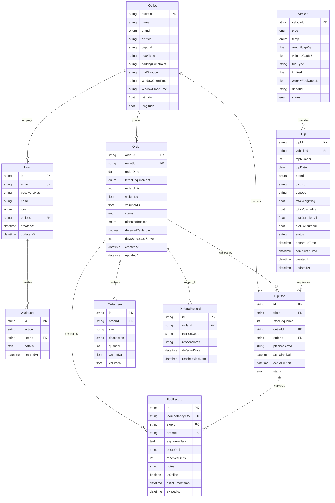

# Waypoint Relational Data Model & Schema Dictionary

## 1. Database Philosophy & Architectural Decisions

The Waypoint persistence layer is designed around **PostgreSQL 16** and managed via **Prisma ORM**. When architecting the schema for a shared logistics network handling 100 outlets, 37 vehicles, and volatile daily order volumes, we prioritized three core engineering principles:

1. **Relational Rigor over Document Stores**: Delivery logistics inherently demand foreign key referential integrity. An order cannot exist without an outlet; a trip stop cannot exist without an assigned trip; a delivery cannot be closed out without an immutable proof-of-delivery record.
2. **Pragmatic Denormalization for Real-Time Polling**: While order items and trip stops are fully normalized, aggregate operational metrics (`totalWeightKg`, `totalVolumeM3`, `totalDurationMin`, `fuelConsumedL`) are cached directly on the `Trip` table. This avoids expensive aggregate `SUM()` joins when dozens of dispatcher dashboards poll the fleet board every 5 seconds.
3. **Idempotent Write-Ahead Logging for Mobile Sync**: Due to erratic 3G/4G connectivity in underground Sri Lankan supermarket loading docks, the schema enforces client-generated UUID `idempotencyKey` constraints on `PodRecord` entries. This guarantees that duplicated HTTP retries never corrupt ledger balances.

---

## 2. Entity-Relationship Overview

---

## 3. Data Dictionary & Table Specifications

### 3.1 `users`
Identity and access management table mapping operational personnel to security domains.
* `id` (`UUID`, Primary Key): Immutable user identifier.
* `email` (`VARCHAR(255)`, Unique): User login handle.
* `passwordHash` (`VARCHAR(255)`): Salted bcrypt digest (cost factor 10).
* `name` (`VARCHAR(255)`): Full operator name.
* `role` (`ENUM`): `dispatcher` | `loader` | `driver` | `store`.
* `outletId` (`VARCHAR(50)`, FK, Nullable): Foreign key referencing `outlets(outletId)`; populated strictly for `store` managers.
* `createdAt` / `updatedAt` (`TIMESTAMP`): Audit timestamps.

### 3.2 `outlets`
Master registry of 100 retail destinations across Sri Lanka.
* `outletId` (`VARCHAR(50)`, Primary Key): Standard outlet code (e.g., `OUT001`).
* `name` (`VARCHAR(255)`): Retail location name.
* `brand` (`ENUM`): Brand segregation category: `Fresh` | `Style` | `Tech`.
* `district` (`VARCHAR(100)`): Administrative district (e.g., `Colombo`, `Gampaha`, `Kandy`).
* `depotId` (`VARCHAR(50)`): Assigned primary fulfillment distribution center (`Peliyagoda` or `Kandy`).
* `dockType` (`VARCHAR(50)`): Dock layout (`street`, `bay`, `underground`).
* `parkingConstraint` (`VARCHAR(50)`): Space limitation (`normal`, `tight`, `permit_required`).
* `mallWindow` (`VARCHAR(50)`, Nullable): Indicator for commercial mall loading restrictions.
* `windowOpenTime` / `windowCloseTime` (`VARCHAR(10)`): Operational delivery window (e.g., `05:00` - `07:30`).
* `latitude` / `longitude` (`DOUBLE PRECISION`): WGS84 coordinates used for route distance matrices and map pins.

### 3.3 `vehicles`
Fleet asset registry containing physical constraints for 37 dedicated delivery vehicles.
* `vehicleId` (`VARCHAR(50)`, Primary Key): Vehicle registration identifier (e.g., `VEH001` - `VEH037`).
* `type` (`ENUM`): Chassis type: `truck` (dual-axle heavy chassis) | `van` (single-axle light transport).
* `temp` (`ENUM`): Thermal capability: `ambient` | `reefer` (refrigerated cold chain).
* `weightCapKg` (`DOUBLE PRECISION`): Maximum legal payload mass in kilograms.
* `volumeCapM3` (`DOUBLE PRECISION`): Maximum interior cargo volume in cubic meters.
* `fuelType` (`VARCHAR(50)`): Fuel specification (default: `diesel`).
* `kmPerL` (`DOUBLE PRECISION`): Fuel consumption baseline under nominal load.
* `weeklyFuelQuotaL` (`DOUBLE PRECISION`): Statutory weekly fuel allocation quota.
* `depotId` (`VARCHAR(50)`): Assigned home base station (`Peliyagoda` or `Kandy`).
* `status` (`ENUM`): Operational readiness: `available` | `in_workshop`.

### 3.4 `orders` & `order_items`
Purchase replenishment orders submitted before the 16:00 SLST daily cutoff.
* `orderId` (`VARCHAR(50)`, Primary Key): Commercial order tracking number.
* `outletId` (`VARCHAR(50)`, FK): References destination `outlets(outletId)`.
* `orderDate` (`DATE`): Targeted fulfillment delivery date.
* `tempRequirement` (`ENUM`): Thermal handling classification: `ambient` | `reefer`.
* `orderUnits` (`INTEGER`): Total aggregate crate or box count.
* `weightKg` / `volumeM3` (`DOUBLE PRECISION`): Measured aggregate weight and volumetric displacement.
* `status` (`ENUM`): `draft` | `confirmed` | `allocated` | `deferred` | `in_transit` | `delivered` | `disputed`.
* `planningBucket` (`ENUM`): Delivery batch: `next_day` | `subsequent_run`.
* `deferredYesterday` (`BOOLEAN`): High-priority flag indicating if the order was bumped from the previous day's run.
* `daysSinceLastServed` (`INTEGER`): Starvation counter ensuring fairness for neglected regional outlets.
* `order_items`: Child table tracking individual SKUs, unit quantities, and individual dimensions.

### 3.5 `trips` & `trip_stops`
Optimized route manifests generated by the OR-Tools solver.
* `tripId` (`VARCHAR(50)`, Primary Key): Manifest identifier (e.g., `TRIP-20261005-001`).
* `vehicleId` (`VARCHAR(50)`, FK): References allocated `vehicles(vehicleId)`.
* `tripNumber` (`INTEGER`): Sequential run for that vehicle on that operational date (1 = Morning, 2 = Afternoon).
* `tripDate` (`DATE`): Operational execution date.
* `brand` (`ENUM`): Dedicated brand segregation for the entire trip.
* `district` (`VARCHAR(100)`): Dedicated geographic boundary.
* `depotId` (`VARCHAR(50)`): Origin distribution hub.
* `totalWeightKg` / `totalVolumeM3` (`DOUBLE PRECISION`): Cached load sums for instant UI rendering.
* `totalDurationMin` (`DOUBLE PRECISION`): Estimated trip completion time (driving + stop service times).
* `fuelConsumedL` (`DOUBLE PRECISION`): Predicted fuel burn based on travel distance and vehicle `kmPerL`.
* `status` (`VARCHAR(50)`): `planned` | `staged` | `in_transit` | `completed`.
* `trip_stops`: Sequenced stops (1 to 3) linking the trip to specific destination outlets and orders.

### 3.6 `pod_records`
Digital proof-of-delivery receipts recorded upon physical handover.
* `id` (`UUID`, Primary Key): Internal record identifier.
* `idempotencyKey` (`VARCHAR(255)`, Unique): Client-generated UUID preventing duplicate insertions on network retry.
* `stopId` (`UUID`, FK): References `trip_stops(id)`.
* `orderId` (`VARCHAR(50)`, FK): References `orders(orderId)`.
* `signatureData` (`TEXT`, Nullable): Base64-encoded vector canvas of the store manager's digital signature.
* `photoPath` (`VARCHAR(255)`, Nullable): File path on persistent volume storing cargo delivery photograph.
* `receivedUnits` (`INTEGER`): Physically verified crate count accepted by store staff.
* `notes` (`VARCHAR(500)`, Nullable): Shortage or exception remarks.
* `isOffline` (`BOOLEAN`): Flag indicating if the receipt was recorded while device had zero cellular signal.
* `clientTimestamp` (`TIMESTAMP`): Hardware clock timestamp when touch signature was captured.
* `syncedAt` (`TIMESTAMP`): Server ingestion timestamp.

---

## 4. Compound Indexing Strategy & Query Optimization

| Table | Index Columns | Optimized Query Pattern & Rationale |
| :--- | :--- | :--- |
| `orders` | `@@index([orderDate, status])` | **Morning Cutoff Batching**: Fetches all `confirmed` orders for tomorrow's date during solver execution without table scan. |
| `orders` | `@@index([outletId])` | **Store Order History**: Speeds up `/store` order lookup and past delivery history queries. |
| `vehicles` | `@@index([depotId, status])` | **Fleet Availability Pool**: Filters available vehicles belonging to the specific dispatch depot (`Peliyagoda` or `Kandy`). |
| `outlets` | `@@index([brand, district])` | **District & Brand Segregation**: Accelerates candidate clustering prior to VRP solver invocation. |
| `trips` | `@@index([tripDate, status])` | **Dispatcher Fleet Board**: Powers the active trips dashboard filtered by today's operational date. |
| `trip_stops` | `@@index([tripId])` | **Route Manifest Rendering**: Fetches ordered stop sequences (1 -> 2 -> 3) for driver route screens. |
| `pod_records` | `@@index([syncedAt])` | **Audit & Sync Reconciliation**: Efficiently fetches incremental sync batches since last sync timestamp. |

---

## 5. Verification: 14 Hard Allocation Rules Mapped to Schema Constraints

| Rule # | Business Constraint | Relational Schema & Validation Enforcement |
| :---: | :--- | :--- |
| **R1** | **Weight Capacity Limit** | Invariant check: $\sum \text{order.weightKg} \le \text{vehicle.weightCapKg}$ |
| **R2** | **Volume Capacity Limit** | Invariant check: $\sum \text{order.volumeM3} \le \text{vehicle.volumeCapM3}$ |
| **R3** | **Cold Chain Temperature** | Constraint: If $\text{order.tempRequirement} = \text{reefer}$, then $\text{vehicle.temp} = \text{reefer}$ |
| **R4** | **Max 3 Stops per Trip** | Invariant: $\text{COUNT}(\text{trip\_stops WHERE tripId} = ?) \le 3$ |
| **R5** | **District Purity** | Invariant: $\text{trip.district} = \text{outlet.district}$ for all stops |
| **R6** | **Brand Exclusivity** | Invariant: $\text{trip.brand} = \text{outlet.brand}$ for all stops |
| **R7** | **Mall Delivery Windows** | Invariant: $\text{trip\_stop.plannedArrival} \in [\text{outlet.windowOpenTime}, \text{outlet.windowCloseTime}]$ |
| **R8** | **Max 2 Runs / Vehicle / Day** | Constraint: $\text{tripNumber} \in \{1, 2\}$ for a given vehicle on a specific `tripDate` |
| **R9** | **Vehicle Workshop Blackout** | Filter: Solver excludes any vehicle where $\text{status} = \text{in\_workshop}$ |
| **R10** | **10-Hour Driver Shift Cap** | Invariant: $\sum \text{trip.totalDurationMin} \le 600$ across all runs assigned to a vehicle/driver |
| **R11** | **Weekly Fuel Quota** | Invariant: Rolling 7-day $\sum \text{fuelConsumedL} \le \text{vehicle.weeklyFuelQuotaL}$ |
| **R12** | **Depot Containment** | Invariant: $\text{outlet.depotId} = \text{vehicle.depotId}$ |
| **R13** | **Prioritize Deferred Orders** | Solver objective function applies priority weight multiplier to $\text{deferredYesterday} = \text{true}$ |
| **R14** | **Starvation Fairness Index** | Solver penalizes starvation where $\text{daysSinceLastServed} \ge 2$ |
