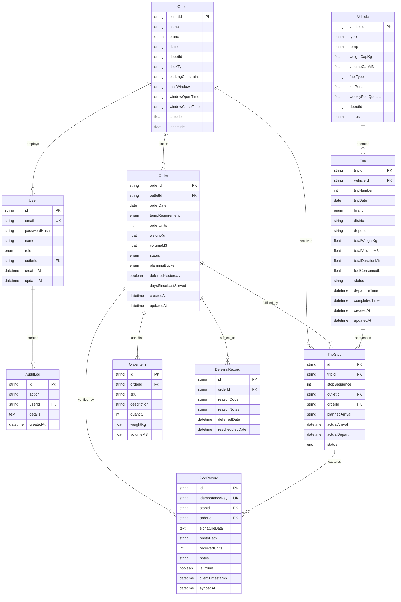

# Waypoint Relational Data Model & Schema Dictionary

## 1. Entity-Relationship Overview

The Waypoint data model is built on PostgreSQL 16 and managed via Prisma ORM. It enforces relational integrity across core retail supply chain entities: users, retail outlets, vehicle fleets, customer store orders, multi-stop trips, and offline-capable proof-of-delivery receipts.

---

## 2. Data Dictionary

### 2.1 `users`
Represents platform actors across 4 role domains.
- `id` (UUID, PK): Unique actor identifier.
- `email` (String, Unique): Login email address.
- `passwordHash` (String): Salted bcrypt password hash.
- `name` (String): Full display name.
- `role` (Enum): `dispatcher` | `loader` | `driver` | `store`.
- `outletId` (String, FK, Nullable): Foreign key to `outlets` for store managers.

### 2.2 `outlets`
Retail destinations served by distribution centers across Sri Lanka.
- `outletId` (String, PK): Standard outlet code (e.g., `OUT-001`).
- `name` (String): Commercial store name.
- `brand` (Enum): `Fresh` (groceries) | `Style` (apparel) | `Tech` (electronics).
- `district` (String): Geographic administrative district (e.g., `Colombo`, `Gampaha`, `Kandy`).
- `depotId` (String): Assigned primary distribution depot.
- `dockType` (String): Dock classification (`street`, `bay`, `underground`).
- `parkingConstraint` (String): Parking limits (`normal`, `tight`, `permit_required`).
- `mallWindow` (String, Nullable): Indicator for mall loading dock restrictions.
- `windowOpenTime` / `windowCloseTime` (String): Delivery hours (e.g., `05:00` - `07:30`).
- `latitude` / `longitude` (Float): WGS84 GPS coordinates for routing and map visualization.

### 2.3 `vehicles`
Fleet assets allocated for delivery runs.
- `vehicleId` (String, PK): Registration / Fleet ID (e.g., `VH-001`).
- `type` (Enum): `truck` | `van`.
- `temp` (Enum): `ambient` | `reefer` (refrigerated cold chain).
- `weightCapKg` (Float): Maximum payload weight in kilograms.
- `volumeCapM3` (Float): Maximum payload volume in cubic meters.
- `fuelType` (String): Fuel category (`diesel`, `petrol`).
- `kmPerL` (Float): Fuel economy rating.
- `weeklyFuelQuotaL` (Float): Fuel allocation cap in liters.
- `depotId` (String): Home depot location.
- `status` (Enum): `available` | `in_workshop`.

### 2.4 `orders` & `order_items`
Commercial order requests submitted by retail outlets.
- `orderId` (String, PK): Unique purchase/replenishment order number.
- `outletId` (String, FK): Destination retail outlet.
- `orderDate` (Date): Requested delivery date.
- `tempRequirement` (Enum): Required storage temperature (`ambient` | `reefer`).
- `orderUnits` (Int): Total crate/case count.
- `weightKg` / `volumeM3` (Float): Aggregate volumetric measurements.
- `status` (Enum): `draft` | `confirmed` | `allocated` | `deferred` | `in_transit` | `delivered` | `disputed`.
- `planningBucket` (Enum): `next_day` | `subsequent_run`.
- `deferredYesterday` (Boolean): Flag indicating priority escalation if previously postponed.
- `daysSinceLastServed` (Int): Fairness tracking metric for starving outlets.

### 2.5 `trips` & `trip_stops`
Optimized delivery routes generated by the allocation engine.
- `tripId` (String, PK): Manifest identifier.
- `vehicleId` (String, FK): Assigned vehicle.
- `tripNumber` (Int): Sequential run number for that vehicle on that day (1 or 2).
- `tripDate` (Date): Operational dispatch date.
- `brand` (Enum): Dedicated brand classification for this trip.
- `district` (String): Geographic district boundary.
- `totalWeightKg` / `totalVolumeM3` (Float): Sum of all stops.
- `totalDurationMin` (Float): Estimated completion time including transit and service time.
- `stops` (`trip_stops`): Sequence of delivery visits (max 3 stops).

### 2.6 `pod_records`
Digital proof-of-delivery receipts captured upon handover.
- `id` (UUID, PK): Unique record identifier.
- `idempotencyKey` (String, Unique): Client-generated UUID preventing duplicate synchronization.
- `stopId` (String, FK): Associated trip stop.
- `orderId` (String, FK): Associated order.
- `signatureData` (Text): Base64 encoded digital signature canvas vector.
- `photoPath` (String, Nullable): Secure URI of captured cargo/dock photo.
- `receivedUnits` (Int): Actual verified item count received.
- `isOffline` (Boolean): Flag indicating if delivery was completed during disconnected network mode.
- `clientTimestamp` (DateTime): Hardware clock timestamp when signature was recorded.
- `syncedAt` (DateTime): Server ingestion timestamp.

---

## 3. Mapping: 14 Hard Allocation Rules to Data Constraints

| Rule # | Business Constraint | Database & Validation Enforcement |
| :---: | :--- | :--- |
| **R1** | **Weight Capacity Limit** | `SUM(order.weightKg) <= vehicle.weightCapKg` |
| **R2** | **Volume Capacity Limit** | `SUM(order.volumeM3) <= vehicle.volumeCapM3` |
| **R3** | **Cold Chain Temperature Integrity** | If `order.tempRequirement == reefer`, then `vehicle.temp == reefer` |
| **R4** | **Maximum 3 Stops per Trip** | `COUNT(trip_stops WHERE tripId = ?) <= 3` |
| **R5** | **Single District Containment** | `trip.district == outlet.district` for all stops on that trip |
| **R6** | **Single Brand Vehicle Dedication** | `trip.brand == outlet.brand` for all stops on that trip |
| **R7** | **Mall Loading Dock Windows** | Arrival time must fall between `outlet.windowOpenTime` and `outlet.windowCloseTime` |
| **R8** | **Maximum 2 Runs per Vehicle/Day** | `tripNumber IN (1, 2)` per vehicle on a given `tripDate` |
| **R9** | **Vehicle Workshop Maintenance** | `vehicle.status == available` (`in_workshop` excluded from solver) |
| **R10** | **10-Hour Maximum Driver Shift** | `totalDurationMin <= 600` across all runs assigned to a vehicle/driver |
| **R11** | **Weekly Fuel Quota Enforcement** | `SUM(trip.fuelConsumedL) <= vehicle.weeklyFuelQuotaL` over 7-day rolling window |
| **R12** | **No Multi-Depot Splitting** | `outlet.depotId == vehicle.depotId` |
| **R13** | **Prioritize Deferred-Yesterday Orders** | `order.deferredYesterday == true` prioritized in solver objective cost function |
| **R14** | **Fairness Constraint on Starved Outlets** | `daysSinceLastServed >= 2` elevated with penalty multiplier |
